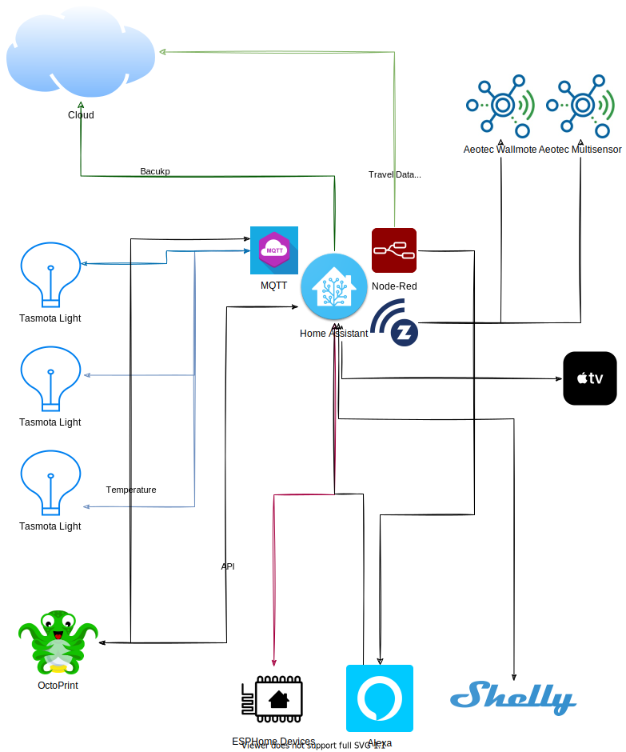

# Home Automation Devices  

- [Devices](#devices)
  - [ESPHome Devices](#esphome-devices)
  - [Tasmota Devices](#tasmota-devices)
  - [Off the Shelf Devices](#off-the-shelf-devices)
  - [Power Monitoring](#power-monitoring)

## Overview  

Just a simple repo about my home automation setup and devices. More a record of what I have been up.

## Hardware  

Intel NUC 5i5MYBE  

## Case

Akasa Newton S  

Very happy with this case, what a difference, very nice. Very complete kit including new cables and numerous mounting options. A little expensive but well worth it.

## Operating System

Due to some issues with a BETA version - I have changed back to the stable build.

Home Assistant OS 7.6
Channel: **Stable**  
Supervisor: **supervisor-2022.03.5**  
Core: **core-2022.4.0**  

## Diagram

**Why this repo?**  
This is a collection of [ESPHome](https://ESPHome.io) configuration files, [Tasmota](https://tasmota.github.io/docs/) dmp files and code for my various ESP8266 devices that integrate with [Home Assistant](https://www.home-assistant.io/). I am using includes and packages pretty extensively in order to prevent duplication and allow for easy changing of common settings.

**What is ESPHome?**  
> ESPHome is a system to control your ESP8266/ESP32 by simple yet powerful configuration files and control them remotely through Home Automation systems. For more information checkout [ESPHome.io](https://ESPHome.io).

**What is Tasmota?**  
> Total local control with quick setup and updates.
Control using MQTT, Web UI, HTTP or serial.
Automate using timers, rules or scripts.
Integration with home automation solutions.
Incredibly expandable and flexible. For more information checkout [Tasmota](https://tasmota.github.io/docs/).

**What is Shelly?**  
> Shelly is a collection of IoT devices that are built for home automation. For more information checkout [Shelly Cloud](https://shelly.cloud/).

**What is Home Assistant?**
> Home Assistant is open source home automation that puts local control and privacy first. Powered by a worldwide community of tinkerers and DIY enthusiasts. Perfect to run on a Raspberry Pi or a local server.  For more information check out [Home-Assistant.io](https://www.home-assistant.io/).

## Custom Devices

### Study

> #### Octopi

I have a simple query that publishes data to a MQTT Topic and then captured by Node-Red and sent into Home-Assistant. My file to publish RPI Temperature to MQTT can be found [here](/python/rpi/temp1-hassos-mqtt.py). You would need to modify the required settings in the file, for example,  

1. MQTT Server
1. MQTT Username
1. MQTT Password
1. MQTT Topic

#### Study Sensor

#### Server Cabinet Fan

### Kitchen  

### Lounge  

> #### [Lounge Light](/tasmota/lounge/Config_loungergbw_5090_9.1.0.dmp)

This lightbulb is based on [Tasmota](https://tasmota.github.io/docs/). Used by my [Home Automation System](https://www.home-assistant.io/) and [Node-Red](https://nodered.org/) for some great automations.  
The file can be found [here](/tasmota/lounge/Config_loungergbw_5090_9.1.0.dmp)  

### Garage

#### Washing Machine SonOff POW

## Devices

### ESPHome Devices

1. NeoPixel-Strip
   1. Ip Address: 192.168.37.22
   2. Identifier: test-neopixel-strip-1 Web Server
   3. Use case: LEDs to let us know the status of our dishwasher, it is integrated dishwasher so we cannot see the front lights and we have often opened the dishwasher whilst it was still running.
   4. File location: [here](/esphome/test-neopixel-strip-1.yaml)

### Tasmota Devices

1. Desk Extension
   1. IP Address: 192.168.37.5
   2. Identifier: Computer Desk Extension
   3. Use case: Power saving and relay for computer desk extension / power strip
   4. File location: [here](/tasmota/deskExtension/Config_tasmota_A28E3D_3645_10.1.0.dmp)

### Off the Shelf Devices

1. Tapo P110
1. Amazon Alexa

Automations:

### Power Monitoring

Currently using TAPO P110 and z-Wave Fibaro Plug

Work Desk: around 300W per day  
TV and Apple TV: around 200W per hour  
Washing Machine:  
Kettle: 2000w pull  
